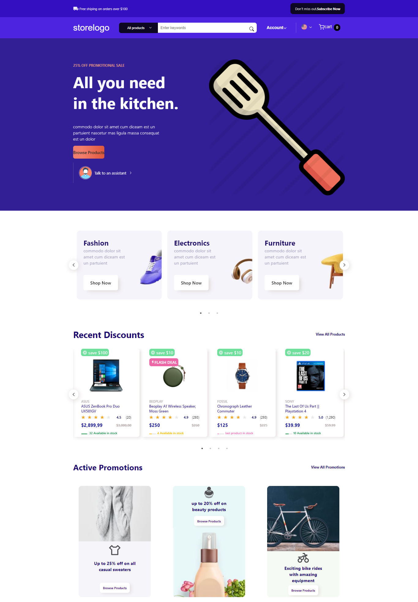

# E-Commerce-Lite
E-commerce store project, uses React.js Hooks, flex-box, sass for styling, some of react libraries and JSON server to simulate back end API

# demo
https://drive.google.com/file/d/1b0BgxwOvP43Jm8J5MiOXSqBCMTZmPg9H/view?usp=sharing
# run project
json-server data/db.json

then 
npm start

# Preview

  

